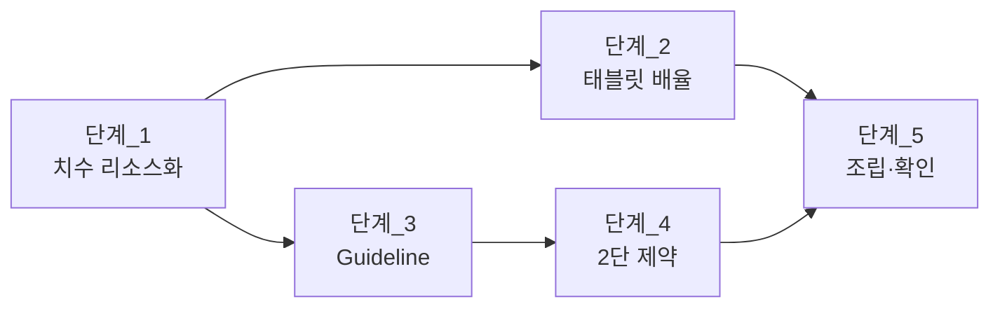

# 계획

**TL;DR**: 다섯 단계로 나눈다. 치수를 리소스로 빼고(폰 값 그대로), 태블릿 배율 두 단을 얹고, 가운데 `Guideline` 을 상주시키고, 태블릿에서만 `ConstraintSet` 으로 2단을 건다. 앞 단계가 통과해야 다음이 성립하도록 순서를 잡았고 각 단계마다 확인 방법을 붙였다.

## 0. 변경 대상

| 파일 | 성격 |
|---|---|
| `res/values/dimens.xml` | 수정 — 치수 6개 추가 |
| `res/values-sw600dp/dimens.xml` | **신설** |
| `res/values-sw720dp/dimens.xml` | **신설** |
| `res/layout/fragment_remote_control.xml` | 수정 — 치수 112곳 치환 + `Guideline` 1개 |
| `activity/MainActivity.java` | 수정 — 접근자 1개 추가 |
| `fragment/RemoteControlFragment.java` | 수정 — 2단 적용 메서드 1개 추가 + 호출 1줄 |

**바인딩 참조 120곳은 건드리지 않는다.** 위젯 `id` 도 전부 그대로다.

## 단계_1 — 치수를 리소스로 뺀다 (폰 값 그대로)

`res/values/dimens.xml` 에 추가한다. 헌법 §7 의 `tdc_` 접두어를 붙인다.

| 이름 | 값 | 현재 쓰임 |
|---|---|---|
| `tdc_text_size_tiny` | 10dp | 1곳 |
| `tdc_text_size_small` | 11dp | 45곳 (상태 격자 등) |
| `tdc_text_size_normal` | 12dp | 38곳 |
| `tdc_text_size_large` | 14dp | 2곳 |
| `tdc_text_size_title` | 18dp | 1곳 |
| `tdc_button_height` | 30dp | 25곳 (버튼 전부) |

`fragment_remote_control.xml` 을 기계 치환한다.

```
android:textSize="10dp"       -> "@dimen/tdc_text_size_tiny"
android:textSize="11dp"       -> "@dimen/tdc_text_size_small"
android:textSize="12dp"       -> "@dimen/tdc_text_size_normal"
android:textSize="14dp"       -> "@dimen/tdc_text_size_large"
android:textSize="18dp"       -> "@dimen/tdc_text_size_title"
android:layout_height="30dp"  -> "@dimen/tdc_button_height"
```

> [!NOTE]
> `layout_height="24dp"` 1곳은 버튼이 아니므로 건드리지 않는다.

**검증_1**: 빌드 통과 · `grep -c 'textSize="[0-9]'` = 0 · `grep -c 'layout_height="30dp"'` = 0 · 치환 수 합계 112.
값이 이전과 같으므로 **폰 화면은 픽셀 단위로 불변**이다(요구사항_6).

## 단계_2 — 태블릿 배율 두 단

`sw` 는 가로 고정 태블릿에서 곧 화면 높이다(분석 §3.4). 기기 높이를 따라 배율이 정해진다.

| 이름 | `values` | `values-sw600dp` (1.3배) | `values-sw720dp` (1.6배) |
|---|---|---|---|
| `tdc_text_size_tiny` | 10dp | 13dp | 16dp |
| `tdc_text_size_small` | 11dp | 14dp | 18dp |
| `tdc_text_size_normal` | 12dp | 16dp | 19dp |
| `tdc_text_size_large` | 14dp | 18dp | 22dp |
| `tdc_text_size_title` | 18dp | 23dp | 29dp |
| `tdc_button_height` | 30dp | **40dp** | **48dp** |

**검증_2**: 빌드 통과. 태블릿에서 글자가 커진다. `sw600` 급의 40dp 는 권장 48dp 미달이나 지금(30dp)보다 낫다(분석 판단_4).

> [!IMPORTANT]
> **의존**: 단계_1 이 통과해야 한다. 이름이 없으면 덮어쓸 대상이 없다.

## 단계_3 — 가운데 `Guideline` 상주

루트 `ConstraintLayout` 의 마지막 자식으로 넣는다.

```xml
<!--
2단 배치의 열 경계. 태블릿에서만 ConstraintSet 이 이것을 참조한다.
폰에서는 아무 제약도 참조하지 않으므로 그려지지도 측정되지도 않는다.
-->
<androidx.constraintlayout.widget.Guideline
    android:id="@+id/tdc_center_guideline"
    android:layout_width="wrap_content"
    android:layout_height="wrap_content"
    android:orientation="vertical"
    app:layout_constraintGuide_percent="0.5" />
```

**검증_3**: 빌드 통과 · 폰 화면 불변(참조하는 제약이 없다).

## 단계_4 — 태블릿에서만 2단 제약

### 4.1 접근자

`MainActivity` 의 태블릿 판정은 `static private` 라 프래그먼트가 못 본다. 접근자를 하나 연다.

```java
/* 실행 시점에 정한 화면 분류. 화면 구성이 이 값을 따라야 하므로 밖에서 읽을 수 있게 연다. */
static public boolean isTabletAtLaunch()
{
    return (sIsTabletAtLaunch != null && sIsTabletAtLaunch);
}
```

> [!NOTE]
> **`res/values/bools.xml` 로 푸는 방법은 접었다.** 리소스는 구성이 바뀌면 즉시 다시 풀리지만 `sIsTabletAtLaunch` 는 **실행 시점에 고정**된다. 폴더블을 접었을 때 둘이 어긋난다. 기존 설계(실행 시점 고정 + 재시작 안내)를 따르는 쪽이 맞다.

### 4.2 2단 배선

`RemoteControlFragment` 에 메서드를 하나 넣고 인플레이트 직후 태블릿일 때만 부른다.

| 묶음 | 위 | 아래 | 좌 | 우 |
|---|---|---|---|---|
| ② ID (헤더) | `parent.top` | — | `parent.start` | `parent.end` |
| ① 상태 격자 | `②.bottom` | `⑦.top` | `parent.start` | `guideline` |
| ⑦ Remote | `①.bottom` | `⑧.top` | `parent.start` | `guideline` |
| ⑧ Etc | `⑦.bottom` | `⑥.top` | `parent.start` | `guideline` |
| ③ 슬롯 | `②.bottom` | `④.top` | `guideline` | `parent.end` |
| ④ Status of files | `③.bottom` | `⑤.top` | `guideline` | `parent.end` |
| ⑤ Buttons | `④.bottom` | `⑥.top` | `guideline` | `parent.end` |
| ⑥ Caution (푸터) | — | `parent.bottom` | `parent.start` | `parent.end` |

두 열 모두 머리에 `chainStyle = packed`, `verticalBias = 0` 을 건다. **위 맞춤**이라야 두 열의 첫 항목이 나란히 선다(분석 판단_5).

열 사이 간격은 각 묶음의 안쪽 마진 `8dp` 로 준다.

### 4.3 순서

```
mRemoteControlBinding = FragmentRemoteControlBinding.inflate(...)
        ↓
MainActivity.isTabletAtLaunch() 이면
        ↓
ConstraintSet.clone(루트)      ← 오버레이 등 나머지 제약을 그대로 떠 온다
        ↓
8묶음의 제약만 지우고 위 표대로 다시 건다
        ↓
applyTo(루트)
```

> [!CAUTION]
> **`clone()` 을 먼저 하는 것이 핵심이다.** 빈 `ConstraintSet` 을 적용하면 연결 오버레이(`remote_control_connection_layout`)의 제약이 사라져 화면이 깨진다.

**검증_4**:
1. 태블릿에서 2단으로 보인다
2. **연결 오버레이가 정상 표시된다** (분석-검증 미검증 항목)
3. 연결 → 해제 → 재연결에서 가시성 전환이 정상이다 (`applyTo` 가 가시성을 되돌리지 않는지)
4. 폰에서 화면이 이전과 같다

> [!IMPORTANT]
> **의존**: 단계_3 이 통과해야 한다. `Guideline` 의 `id` 가 있어야 참조한다.

## 단계_5 — 조립과 확인

**검증_5**:

| 항목 | 방법 |
|---|---|
| 빌드 | `assembleDebug` 통과 |
| 대상 기기의 `sw` | 앱 로그 `[SCREEN] 가장 작은 변 NNNdp` (`MainActivity.java:340`) |
| 세로 넘침 | 태블릿에서 `Caution` 이 잘리지 않는지 |
| 글자 잘림 | 격자에 `...` 이 뜨는 항목이 있는지 |
| 폰 회귀 | 폰에서 이전 화면과 대조 |

## 테스트 순서 (의존성)



- 단계_2 는 단계_1 을 전제한다 (덮어쓸 이름이 있어야 한다)
- 단계_4 는 단계_3 을 전제한다 (`Guideline` `id` 가 있어야 한다)
- 단계_1 과 단계_3 은 서로 독립이다

## 범위 밖

| 항목 | 이유 |
|---|---|
| 다른 화면(`fragment_settings` · `fragment_log` · `fragment_manual` 등) | 이번 지시는 리모콘 화면에 대한 것이다. 태블릿에서 이 화면들은 폰 치수 그대로 남는다 |
| 다이얼로그 글자 크기 | 위와 같다 |
| 폰 화면의 `packed` 적용 | 요구사항_6. 폰은 여유 175dp 라 지금도 답답하지 않다 |

## 되돌리기

각 단계가 독립 커밋이므로 단계 단위로 되돌릴 수 있다. 단계_4 만 되돌리면 태블릿도 1단으로 돌아가되 글자는 커진 상태로 남는데, **그 조합은 세로가 넘친다**(분석 §3.3). 되돌린다면 **단계_2 와 단계_4 를 함께** 되돌려야 한다.
