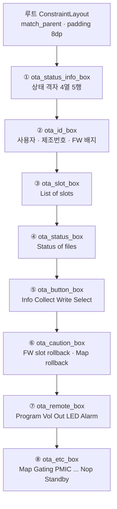
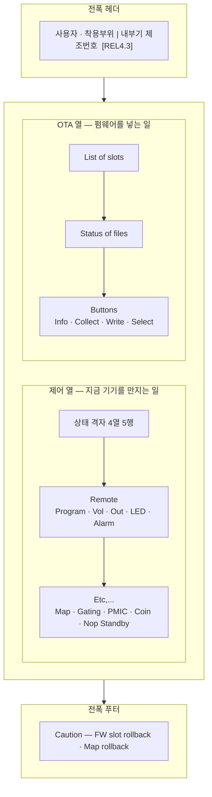

# 분석

**TL;DR**: 벌어짐은 가로가 압도적이다 — 태블릿 가로 높이는 폰 세로보다 오히려 작고 폭만 3.3배다. 8묶음이 이미 루트의 형제라 2단은 계층 변경 없이 제약만 바꾸면 되고, 그러면 바인딩 참조 120곳을 건드리지 않는다. `Caution` 은 쪼개지 않고 전폭 푸터로 둔다.

## 1. 지금 구조

8묶음 모두 `width=0dp` + `start/end→parent`(전폭), `height=wrap_content`, 위아래로 이어진 **세로 체인**이다. 체인 머리는 `parent.top`, 꼬리는 `parent.bottom` 에 물려 있다.

> [!IMPORTANT]
> **8묶음은 전부 루트의 직계 형제다.** 2단 배치에 필요한 것은 «누가 누구 옆에 오는가»뿐이고 이는 **제약(constraint)만의 문제**다. 부모를 바꿔 넣을 필요가 없다. 이 사실이 아래 판단_1 을 결정한다.

## 2. 원인 — 두 축이 따로 벌어진다

### 2.1 가로 (지배적)

각 묶음이 전폭이고 격자 칸은 `layout_weight="1"` 4열이다. 칸 폭 = `(화면폭 − 16) / 4` 로 **화면 폭에 비례**하는데, 글자는 `11dp` 고정이다.

| 기기 | 폭 | 칸 폭 | `Cur 4.2V` 차지 | 빈 공간 |
|---|---|---|---|---|
| 폰 (1080×2340 @2.75) | 393dp | 94dp | 약 55dp | 41% |
| 태블릿 가로 (2560×1600 @2.0) | 1280dp | 316dp | 약 55dp | **83%** |

**폭이 3.26배가 되는 동안 글자는 1배다.** 늘어난 폭 전부가 빈 공간이 된다.

### 2.2 세로 (부수적)

체인 `chainStyle` 이 지정되지 않아 기본 `spread` 다. 남는 높이가 **바깥 2곳 + 사이 7곳, 총 9군데 틈으로 균등 분배**된다.

> [!NOTE]
> **뜻밖의 사실 — 태블릿 가로가 폰 세로보다 «높이가 작다».**
> 폰 세로 851dp vs 태블릿 가로 800dp. 세로 여유는 태블릿에서 오히려 **줄어든다.**
> 즉 «화면 끝에서 끝까지 벌어진다»는 체감은 **거의 전부 가로 문제**다.
> 이 사실은 다음 절의 배율 상한을 강하게 제약한다.

## 3. 높이 예산

### 3.1 계산 방법

실측이 아니라 계산이다. 근거를 밝힌다.

| 구성 | 높이 산정 | 근거 |
|---|---|---|
| 글자 행 | `textSize × 1.45 + marginTop` | 폰트 ascent+descent 통상값 |
| 버튼 행 | `30dp + 2dp` | `layout_height="30dp"` 25곳 · `marginTop="2dp"` 9곳 |
| 섹션 제목 | `12 × 1.45 + 6` ≈ 24dp | `marginTop="6dp"` 4곳 |
| 라디오 행 | 약 40dp | `RadioButton` 기본 높이 |

### 3.2 묶음별 현재 높이 (추정)

| 묶음 | 구성 | 높이 |
|---|---|---|
| ① 상태 격자 | 5행 × 18 | 90dp |
| ② ID | 1행 + 배지 | 24dp |
| ③ 슬롯 | 제목 24 + 라디오 40 | 64dp |
| ④ Status of files | 6행 × 18 | 108dp |
| ⑤ Buttons | 제목 24 + 버튼 32 | 56dp |
| ⑥ Caution | 제목 24 + 버튼 32 | 56dp |
| ⑦ Remote | 제목 24 + 2행 × 32 | 88dp |
| ⑧ Etc | 제목 24 + 3행 × 32 | 120dp |
| | **합계** | **606dp** |

### 3.3 1단이면 배율을 못 올린다

태블릿 가로 가용 높이 = `화면높이 − 상태바 24 − 툴바 56 − 패딩 12`.

| 기기 | 가용 높이 | 1단 여유 | 1단 배율 상한 |
|---|---|---|---|
| 태블릿 800dp | 708dp | 102dp | **1.16배** |
| 태블릿 720dp | 628dp | 22dp | **1.03배** |
| 태블릿 600dp | 508dp | **−98dp (이미 넘침)** | **불가** |

> [!WARNING]
> **작은 태블릿에서는 지금도 세로가 넘쳐 잘리고 있을 수 있다.** 1단을 유지한 채로는 ②(치수 확대)를 실질적으로 적용할 수 없다.

### 3.4 2단이면 배율이 열린다

전폭 헤더(②) + 2열 + 전폭 푸터(⑥) 구성에서 **높이를 정하는 것은 더 긴 열**이다.

| 부분 | 구성 | 높이 |
|---|---|---|
| 헤더 | ② ID | 24dp |
| **제어 열** | ① 90 + ⑦ 88 + ⑧ 120 | **298dp** |
| OTA 열 | ③ 64 + ④ 108 + ⑤ 56 | 228dp |
| 푸터 | ⑥ Caution | 56dp |
| | **높이 = 24 + 298 + 56** | **378dp** |

**606dp → 378dp. 세로 요구가 38% 줄어든다.**

| 기기 | 가용 높이 | 2단 배율 상한 | 채택 배율 |
|---|---|---|---|
| 태블릿 800dp | 708dp | 1.87배 | 1.6배 (여유 103dp) |
| 태블릿 720dp | 628dp | 1.66배 | 1.6배 (여유 23dp) |
| 태블릿 600dp | 508dp | 1.34배 | **1.3배** |

`smallestScreenWidthDp` 는 가로 고정 태블릿에서 **곧 화면 높이**다. 그래서 `sw600dp`/`sw720dp` 두 단으로 나누면 배율이 기기 높이를 따라간다.

### 3.5 가로 검산

2단에서 열 폭 = `(1280 − 16 − 16) / 2` = 624dp. 격자 칸 = 156dp.
`18dp` 글자로 `Cur 4.2V` 는 약 89dp → **빈 공간 43%** (지금 83%).

## 4. 판단

### 판단_1 — 2단을 무엇으로 구현하는가

| 대안 | 본문 한 벌 | 바인딩 120곳 | 미리보기 | 평가 |
|---|---|---|---|---|
| `layout-sw600dp` 에 전체 복제 | **✗ drift** | 무손상 | ○ | 요구사항_4 위반 |
| `<include>` 8개로 분해 | ○ | **✗ 전부 수정** | ○ | 변경량 최대. DataBinding 은 include 를 한 단계 아래로 노출해 `binding.otaEtcBox.xxx` 가 된다 |
| **`ConstraintSet` 을 태블릿에서만 적용** | **○** | **○ 무손상** | ✗ | **채택** |
| `ConstraintLayoutStates` | ○ | ○ | △ | 2.2.1 에서 가능하나 팀에 생소하고 실패 시 진단이 어렵다 |

**채택: `ConstraintSet`.** 근거는 §1 의 «8묶음이 이미 형제» 다. 계층을 바꿀 일이 없으므로 제약만 갈아 끼우면 되고, XML 은 한 벌로 남으며 바인딩 참조 120곳(2개 파일)이 그대로다.

세로 가운데에 `Guideline` 하나를 XML 에 상주시킨다. 폰에서는 아무 제약도 이를 참조하지 않으므로 **영향이 0** 이다.

### 판단_2 — `ota_id_box` (미결_1)

**전폭 헤더.** 사용자·착용부위·내부기 제조번호·FW 배지는 «지금 붙어 있는 기기가 무엇인가»라 어느 일을 하든 필요하다. 한 열에 가두면 다른 열을 볼 때 시선이 건너간다.

### 판단_3 — `ota_caution_box` (미결_2)

**쪼개지 않는다. 전폭 푸터로 둔다.**

요구사항 단계의 잠정안(쪼개기)을 **철회한다.** 두 가지가 바뀌었다.

1. `ConstraintSet` 은 부모를 바꾸지 못한다. 쪼개려면 XML 에서 상자를 갈라야 하고 그러면 폰 화면이 바뀐다(요구사항_6 위반)
2. 쪼개면 «되돌릴 수 없는 동작을 한군데 모은다»는 안전 설계를 잃는다. 요구사항 §3 에 적어 둔 반대 근거가 그대로 살아 있다

전폭 푸터는 **두 문제를 동시에 없앤다.** 위쪽 헤더(ID)와 대칭이고, 위험한 동작이 양쪽 열과 시각적으로 분리된다.

### 판단_4 — 배율

| 한정자 | 배율 | 글자 11dp | 글자 12dp | 버튼 30dp |
|---|---|---|---|---|
| `values` (폰) | 1.0 | 11dp | 12dp | 30dp |
| `values-sw600dp` | 1.3 | 14dp | 16dp | **40dp** |
| `values-sw720dp` | 1.6 | 18dp | 19dp | **48dp** |

> [!CAUTION]
> **요구사항_5(터치 타깃 48dp)는 작은 태블릿에서 만족하지 못한다.** `sw600dp` 급에서 버튼을 48dp 로 올리면 제어 열이 541dp 가 되어 가용 508dp 를 넘는다. 40dp 로 타협한다. 지금(30dp)보다는 나아진다.

### 판단_5 — `packed` 적용 범위

**태블릿만.** `ConstraintSet` 이 태블릿에서만 도는 구조라 폰은 자동으로 지금 그대로다(요구사항_6 충족). 폰은 여유가 175dp 라 틈이 19dp 씩이고 이는 답답하지 않다.

두 열은 `packed` + `verticalBias=0` 으로 **위 맞춤**한다. 열 높이가 서로 다른데(298 vs 228) 가운데 맞춤을 하면 두 열의 첫 항목이 어긋나 읽기 어렵다.

### 판단_6 — 치수 이름

역할 기반이 이상적이나 87곳을 사람이 하나씩 분류하면 오분류가 생긴다. **값 기반으로 기계 치환**한다.

`tdc_text_size_tiny`(10) · `tdc_text_size_small`(11) · `tdc_text_size_normal`(12) · `tdc_text_size_large`(14) · `tdc_text_size_title`(18) · `tdc_button_height`(30)

헌법 §7 의 `tdc_` 접두어를 따른다.

## 5. 태블릿 목표 화면

## 6. 요구사항 수정

| 요구사항 | 수정 | 이유 |
|---|---|---|
| 요구사항_7 | «코드 수정 없음» → **«기존 바인딩 참조 120곳을 건드리지 않는다»** | `ConstraintSet` 적용 코드는 새로 넣어야 한다. 지키려는 실질은 기존 참조 무손상이다 |
| 요구사항_5 | «48dp 이상» → **«`sw720dp` 이상에서 48dp, `sw600dp` 급은 40dp»** | 판단_4 의 세로 예산 충돌 |

## 7. 남은 불확실성

| 항목 | 상태 |
|---|---|
| 대상 태블릿의 dp 크기 | **모른다.** 그래서 두 단(`sw600`/`sw720`)으로 나눠 어느 쪽이 걸려도 넘치지 않게 했다 |
| 높이 추정의 정확도 | **계산이지 실측이 아니다.** 실기 캡처 한 장이면 `1.45` 계수와 여백을 실측으로 바꿀 수 있다 |
| 격자 글자 잘림 | 칸이 넓어지므로 `ellipsize` 가 발동할 일은 줄지만, `18dp` 로 키운 뒤 가장 긴 문자열이 156dp 를 넘는지는 빌드 후 확인해야 한다 |
