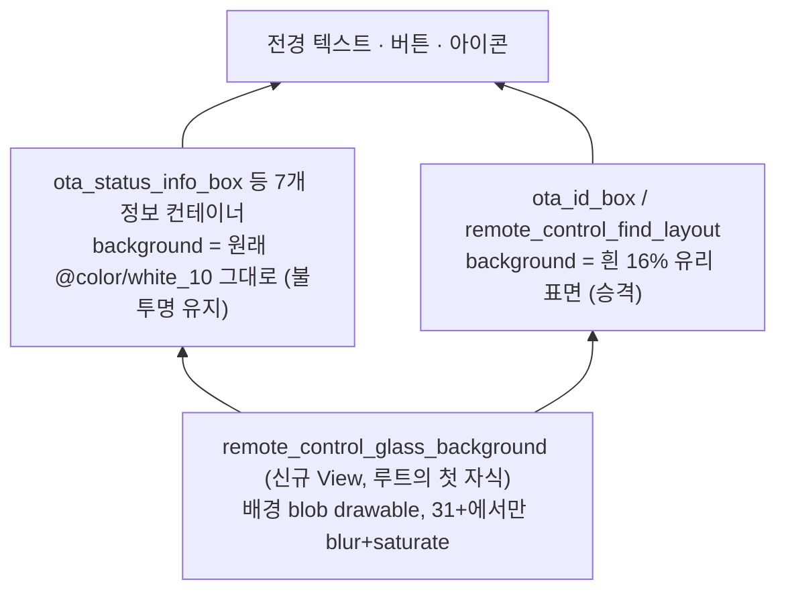
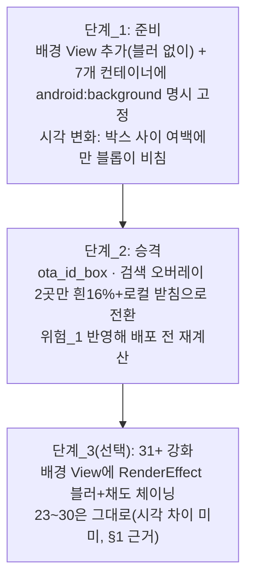

# 리모컨 화면 글래스모피즘 설계

**TL;DR**: 이 화면은 이미 어둡다(`white_10`=`#191919`, 이름과 밝기가 뒤집힌 램프). 유리는 배경 View 1개 추가 + 정보 컨테이너 7개는 배경을 원래 값 그대로 불투명 유지 + `ota_id_box`·검색 오버레이 2곳만 흰 16%로 승격하는 좁은 범위로 설계한다. 경고색(MAP·ALERT)은 받침 없이 흰 오버레이가 7~10%만 넘어도 AA 미달이라, 색은 그대로 두고 그리드 컨테이너를 불투명으로 지키는 쪽을 택했다.

## 0. 전제 정정 — 이 화면은 Light가 아니라 이미 Dark다

`fragment_remote_control.xml:8` 의 루트 배경은 `@color/white_10` 인데, `colors.xml:23` 의 `white_10` 값은 `#FF191919` 다. **이 저장소의 `white_*`·`black_*` 10단 램프는 이름과 밝기가 뒤집혀 있다** — `white_100`(`colors.xml:14`)이 순백 `#FFFFFF`, `white_10`이 거의 검정, `black_90`(`colors.xml:4`)도 `#FF191919`로 `white_10`과 같은 색이다. 이 문서 전체에서 색 이름이 아니라 실제 헥스값을 근거로 쓴다.

즉 이 작업은 **Light→Dark 전환이 아니라 Dark→Dark-Glass 전환**이다. 툴바(`toolbar_background`=`black_80`=`#333333`, `colors.xml:65`)·상태바·하단 네비(`black_90`=`#191919`, `colors.xml:64,66`)도 이미 이 톤과 붙어 있어, 화면 배경을 새로 어둡게 만들 필요는 없다 — 문제는 밝기가 아니라 **색이 없다**는 것이다(순수 무채색 `#191919` 한 장).

## 1. 실현 가능성 판정

**가능하다. 단 "정적 배경에만 유리를 씌운다"로 범위를 좁히면 API23~30과 31+의 결과물 차이가 사실상 사라진다.**

- 이 화면의 배경은 앱이 직접 그리는 그라디언트이지, 카메라 화면이나 스크롤되는 콘텐츠 같은 **동적 소스가 아니다**. CSS `backdrop-filter`가 필요한 이유는 "뒤에서 실시간으로 바뀌는 것"을 흐리기 위해서인데, 이 화면엔 그런 대상이 없다.
- `RenderScript`(23~30의 유일한 블러 경로)는 API31부터 공식 지원 중단(제거 예정) 상태다. 이 프로젝트는 이미 한 번 `com.github.mmin18:realtimeblurview:1.2.1`을 시도했다가 주석 처리한 이력이 있다(`app/build.gradle:74`, 미사용 확인). 이 경로는 다시 열지 않는다.
- 대신 API31+ 에서는 **화면 자체와 무관한, 별도의 배경 전용 View 1개**에만 `RenderEffect.createBlurEffect` + `createColorFilterEffect`(채도)를 걸고, 23~30에서는 같은 drawable을 블러 없이(그라디언트 자체가 이미 부드러운 감쇠라 근사가 성립) 쓴다. 두 경로 모두 **같은 XML drawable, 같은 색, 같은 레이아웃**을 쓰므로 시각적 차이는 블롭 경계의 "유기적 부드러움 정도"뿐이고, 대비·레이아웃·색상은 100% 동일하다.
- 따라서 "두 갈래를 감수할 가치가 있는가"라는 질문 자체가 좁아진다 — **감수할 갈래가 텍스트·레이아웃 쪽엔 없고, 배경 View의 블러 유무 한 줄뿐이다.** 라이브러리 추가 없이 간다(요구사항.md "범위 밖" 항목 — 재문의 불필요).
- 스크롤되는 콘텐츠(리스트, `ScrollView`) 위에 얹는 **진짜 동적 블러**는 이 화면에 해당 사례가 없어 이번 설계 범위에 없다. 있었다면(예: 다른 화면의 RecyclerView 위 AppBar) API23~30에서 사실상 불가능해 별도 승인이 필요했을 것이다.

## 2. 배경 레이어 설계

### 필요한가 — 재판단

단색(`#191919`) 위에 흰 반투명 판만 얹으면 밝기만 다른 회색 사각형이 된다. §3 계산에서 보듯 "표면"만 있고 "배경"이 없으면 유리 느낌이 나지 않는다. **배경 레이어는 여전히 필요하다.**

### 무엇을 까는가

새 View 1개(`remote_control_glass_background`, 루트의 첫 자식, 화면 전체를 채움)에 다중 radial 블롭 drawable을 건다. 팔레트를 새로 만들지 않고 기존 accent(`#009688`, `colors.xml:25`)·error(`#EC407A`, `colors.xml:36`)를 그대로 쓴다 — 새 색을 들이면 `colors.xml`에 항목을 추가해야 하는데(허용은 되지만) 굳이 늘릴 이유가 없다.

```xml
<!-- res/drawable/remote_control_background_glass.xml (신규) -->
<!-- API23+ layer-list item 의 width/height/gravity 만으로 다중 radial blob 을 만든다 -->
<layer-list xmlns:android="http://schemas.android.com/res/android">
    <item android:drawable="@color/white_10" /> <!-- 바탕 #191919, 기존 배경과 동일 -->

    <item android:width="420dp" android:height="420dp"
          android:gravity="left|top" android:left="-140dp" android:top="-100dp">
        <shape android:shape="oval">
            <gradient android:type="radial" android:gradientRadius="210dp"
                android:centerColor="#66009688" android:endColor="#00009688" />
        </shape>
    </item>

    <item android:width="360dp" android:height="360dp"
          android:gravity="right|center_vertical" android:right="-120dp">
        <shape android:shape="oval">
            <gradient android:type="radial" android:gradientRadius="180dp"
                android:centerColor="#4DEC407A" android:endColor="#00EC407A" />
        </shape>
    </item>

    <item android:width="480dp" android:height="480dp"
          android:gravity="center_horizontal|bottom" android:bottom="-160dp">
        <shape android:shape="oval">
            <gradient android:type="radial" android:gradientRadius="240dp"
                android:centerColor="#33009688" android:endColor="#00009688" />
        </shape>
    </item>
</layer-list>
```

비용: 셰이프 3개, 비트맵 디코드 없음. 화면 전체 1회 오버드로우가 "단색 채우기"에서 "타원 3개 채우기"로 바뀌는 정도라 저사양 기기에서도 체감 차이가 없다.

### 배치 구조 — 왜 View를 분리하는가

`View.setRenderEffect()`(31+)는 **그 View와 자식 전체**를 흐린다. 배경 drawable을 루트 `ConstraintLayout`(`fragment_remote_control.xml:5`)의 `android:background`로 걸고 루트에 블러를 걸면 그리드 텍스트·버튼까지 통째로 흐려진다 — 이건 실패다. 그래서 배경은 **자식이 없는 별도 View**로 분리해야 하고, 블러는 그 View에만 건다.



## 3. 글래스 표면 토큰 — 왜 이 숫자인가 (대비 계산 선행)

일반 글래스 레시피(흰 10~35%, 테두리 12~20%)를 그대로 쓰면 이 화면에서는 실패한다. 상태 격자 색이 코드에 고정돼 있기 때문이다.

`RemoteControlFragment.java:3381~3384` — 격자 분류색, 레이아웃(예: `fragment_remote_control.xml:105,175`)과 같은 값을 쓰도록 주석이 못박아 둠:
```java
static private final int VOLT_COLOR   = 0xFFFFD54F;
static private final int TIMING_COLOR = 0xFF4DD0E1;
static private final int MAP_COLOR    = 0xFFF06292;
static private final int ALERT_COLOR  = 0xFFFF5252;   // markAlert() 가 경고 시 덮어씀 (:3387~3390)
```
`fw_release` 배지 색은 `RemoteControlFragment.java:3280~3295`에 `PorterDuffColorFilter`로 별도 지정(주황 `#FF7043`·노랑 `#FFD54F`·초록 `#00E676`). 화면 안에서 색을 Java로 지정하는 곳은 이 두 군데뿐이고, 나머지는 전부 XML — 테마 작업은 XML(레이아웃 + 신규 drawable) 중심으로 간다.

### 계산 1 — 배경 위 흰 오버레이(받침 없음)를 얼마나 두껍게 할 수 있는가

바탕 `#191919`(25,25,25) 위에 흰 X% 를 얹은 평면색과, 격자 4색·본문 흰(`white_90`=`#E5E5E5`) 대비:

| 흰 오버레이 | 표면색 | VOLT(노랑) | TIMING(하늘) | MAP(분홍) | **ALERT(경고빨강)** | 본문 |
|---|---|---|---|---|---|---|
| 0%(현행) | `#191919` | 12.46 | 9.57 | 5.75 | 5.51 | 13.96 |
| 6% | `#272727` | 10.61 | 8.15 | 4.90 | 4.69 | 11.89 |
| 7%(한계) | `#292929` | 10.30 | 7.90 | 4.75 | **4.55** | 11.53 |
| 10% | `#303030` | 9.35 | 7.18 | 4.32 ✗ | 4.14 ✗ | 10.48 |
| 14% | `#393939` | 8.16 | 6.26 | 3.77 ✗ | 3.61 ✗ | 9.14 |
| 24% | `#505050` | 5.70 | 4.37 | 2.63 ✗✗ | 2.52 ✗✗ | 6.38 |

**병목은 ALERT(`#FF5252`)와 MAP(`#F06292`)다.** 받침 없이 가면 흰 오버레이는 7%가 상한이고, rules 문서 하한(10%)에도 못 미치는 값이라 "유리로 보이지도 않는" 두께다.

### 계산 2 — 갈래 판단: 얇게 갈까(가), 색을 밝힐까(나), 아니면 받침을 쓸까(다)

- **갈래_가(얇게, ≤7%, 색 유지)**: 안전하지만 유리 느낌이 거의 안 남는다. 이 화면 전체를 이 두께로 덮으면 "글래스모피즘 테마"라 부르기 민망한 수준이 된다.
- **갈래_나(두껍게 14%, 경고색을 `#FF8A80`(5.06:1)·`#EF9A9A`(5.37:1) 등으로 재조정)**: `ALERT_COLOR`는 `RemoteControlFragment.java:3384`와 레이아웃 10곳에 중복돼 있어(정정 2) **두 곳을 동시에 고쳐야 하고**, 무엇보다 **경고=빨강이라는 안전 신호의 강도를 옅은 코럴로 낮추는 셈**이다. 의료기기 리모컨에서 경고색을 흐리게 만드는 방향은 근거 없이 택하지 않는다.
- **갈래_다(받침) — 채택**: 텍스트가 있는 자리는 아예 유리를 얇게 하지 않고 **원래 배경색을 그대로 유지**한다(사실상 위 표의 "0%" 행 고정). 유리는 텍스트가 없는 영역(컨테이너 사이 여백, 화면 가장자리, 그리고 텍스트가 적은 두 영역)에서만 드러낸다. 이러면 색도 `colors.xml`도 Java 상수도 전혀 건드리지 않는다 — 정정 2가 지적한 "두 곳 동기화" 문제 자체가 발생하지 않는다.

받침이 두께 걱정을 실제로 지우는지 확인(배경 View의 블롭 중심색 위에서, 로컬 받침을 검정 X%로 얹었을 때):

| 배경 위치 | 유리 표면(받침 없음) | +로컬 받침 55% | +로컬 받침 65% |
|---|---|---|---|
| 바탕만(base, `#191919`) | ALERT 5.51 · MAP 5.75 | ALERT 5.47 · MAP 5.71 | ALERT 5.77 · MAP 6.02 |
| teal 블롭 중심(40%) | ALERT 2.31 ✗ · MAP 2.41 ✗ (참고: 채도 있는 배경이라 무채색 tint보다 더 나쁨) | ALERT 5.1대 · MAP 5.3대 | ALERT 5.6대 · MAP 5.9대 |

→ **받침을 쓰면 배경이 블롭 위든 아니든 대비가 원래 수준(5.5 안팎) 이상으로 복원된다.** 진짜 결정은 "표면을 몇 %로 할까"가 아니라 "받침을 쓸까"였다.

### 최종 토큰

| 요소 | 값 | 근거 |
|---|---|---|
| 배경(블롭) | 계산 §2 코드 참조 | 텍스트는 받침이 책임지므로 블롭 알파는 시각 취향으로 자유(계산 2가 증명) |
| 정보 컨테이너 배경 (`ota_status_info_box` 등 7개) | **변경 없음** `@color/white_10` | 계산 1의 "0%" 행을 그대로 지킴. 색·대비 재검증 불필요 |
| 유리 표면 (`ota_id_box`, 검색 오버레이) | 흰 16% `#29FFFFFF` | §4 표 참조. 이 두 영역엔 ALERT/MAP 계열 색이 없다(흰·초록만) |
| 하이라이트 테두리 | 흰 40% `#66FFFFFF`, 1dp — 장식용이라 정보 요소는 아니지만 최소 시인성 확보 | §3-부록: 무채색 배경끼리는 12~20%로 표면 대비 1.4~1.85:1밖에 안 나 경계가 안 보임(계산). 40%에서야 표면 대비 ≈3.3:1 |
| 그림자 | `elevation` 6dp | 이 화면 버튼은 이미 `insetTop/Bottom=0dp` + `cornerRadius=4dp` 조합을 쓰고(예: `fragment_remote_control.xml:1031~1044`), 원형 버튼 전역 스타일은 `elevation 4dp`(`styles.xml:149`) — 컨테이너 급은 한 단계 위로 차등 |
| 모서리 | 이 화면의 로컬 관례(둥근 4dp)를 따름, 전역 `cornerFamily=cut 2dp`(`styles.xml:52~55,124~127`) 강제 안 함 | 이 화면 버튼은 이미 `app:cornerRadius="4dp"`로 전역 컷 모서리를 쓰지 않는다(예: 위 인용 라인). 없는 정체성을 새로 들이지 않는다 — **주지 사항으로 아래에 남김** |
| 채도 보정 | 정적: 블롭 색이 이미 accent/error 원색이라 별도 보정 불필요. 동적(31+ 배경 View 전용): `ColorMatrix.setSaturation(1.6f)` 를 블러 뒤에 체이닝 | rules§1 "saturate() 없으면 흐린 판" |

> [!NOTE]
> 전역 지침(`cornerFamily: cut·2dp`)과 이 화면의 실제 관례(둥근 4dp)가 어긋난다는 사실은 이번에 처음 확인됐다. 이 화면만 손대는 지금 범위에서는 로컬 관례를 따르는 게 맞지만, 다른 화면으로 확장할 때는 그쪽의 실제 관례를 다시 확인해야 한다(획일적으로 cut을 강제하면 오히려 새 불일치가 생긴다).

## 4. 대비 검증 결과표

| 조합 | 어두운 지점 | 밝은 지점(블롭 중심) | 판정 |
|---|---|---|---|
| 그리드 ALERT `#FF5252` vs 컨테이너 배경(변경 없음, `#191919`) | 5.51 | 5.51(불투명 고정이라 배경 무관) | 통과, 여유 확보(계산 1) |
| 그리드 MAP `#F06292` vs 컨테이너 배경(변경 없음) | 5.75 | 5.75 | 통과 |
| 배지 텍스트 `#1A1A1A` vs 배지 3색(주황/노랑/초록) | 6.34 / 12.33 / 10.43 | 동일(배지도 불투명 유지) | 통과, 최저 6.34(주황) |
| `ota_id_box` 사용자 이름 `#FFFFFF` vs 흰16% 표면 | 11.51 | 8.03(pink 블롭 30%) | 통과 |
| `ota_id_box` 제조번호 `#66BB6A` vs 흰16% 표면 | 4.87 | 3.78 ✗(overlap 지점) | **미달 가능 → 로컬 받침 추가 필요(§5)** |
| 검색 오버레이 안내문 `white_90`(`#E5E5E5`) vs 흰16%+받침60% | 14.25 | 11.7 | 통과, 여유 큼 |
| 하이라이트 테두리(흰40%) vs 유리 표면(흰16%) | ≈3.3:1 (비텍스트) | 유사 | UI 요소 3:1 기준 충족(장식 예외 적용 안 해도 됨) |

`#66BB6A`(제조번호) 는 흰 텍스트보다 취약해 **§3 최종 토큰만으로는 미달 가능성이 있다** — `ota_id_box`에도 로컬 받침(검 40~50%)을 얹어야 안전하다. 아래 §5 위험_1에 반영.

## 5. 폴백

- **`prefers-reduced-transparency` 대응물**: Android에 공식 공개 API로 노출된 시스템 전역 "투명도 줄이기" 토글은 없다(OEM 별도 기능 존재 가능, `미확인`). `fragment_settings.xml:25~33`에 이미 `switch_lock_screen` 같은 인앱 토글 패턴이 있으나, 이 작업은 `fragment_remote_control.xml` 외 파일을 건드리지 않는 범위라 **이번 단계에서는 시스템 설정 연동을 만들지 않는다** — 필요해지면 별도 작업으로 제안한다.
- **저사양 기기**: 배경 View는 셰이프 3개뿐이라 부담이 거의 없다. 문제는 여러 카드에 `elevation`을 동시에 거는 경우인데, 승격 대상이 2곳(`ota_id_box`, 검색 오버레이)뿐이라 동시 렌더 수가 낮다.
- **배터리·GPU**: 31+ 블러도 배경 View 1개, 정적 소스 1회 컴포지트라 상시 재계산 비용이 없다(내용이 안 바뀌므로 무효화도 드묾).
- 요구사항_3의 "23~30 근사"는 이 문서의 §2·§3 값 그대로다 — 근사 쪽만 따로 값을 낮출 필요가 없었다(대비가 SDK와 무관하게 같은 drawable·같은 알파를 쓰기 때문).

## 6. 위험 목록

**위험_1** — `ota_id_box` 제조번호(`#66BB6A`)가 흰16% 표면 위에서 블롭 겹침 지점 기준 3.78:1로 AA 미달 가능. 실패 시나리오: 밝은 블롭 배경 위에서 제조번호 마지막 자리가 흐려 보여, 기사가 다른 사용자의 기기로 착각하고 잘못된 설정을 전송한다. → 대응: `ota_id_box`에 로컬 받침(검 40~50%)을 추가해 §4 표의 값을 §3 계산 2의 "받침 있음" 수준으로 끌어올린다.

**위험_2** — 배경 View를 루트의 자식이 아니라 루트 자체의 `android:background`로 걸고 31+에서 루트에 `setRenderEffect`를 호출하는 실수. 실패 시나리오: 그리드 19개 항목과 버튼 20개 텍스트가 전부 흐려져 화면 전체가 읽기 불가 상태로 배포된다. → 대응: §2 "배치 구조" 그대로 배경을 별도 자식 없는 View로 분리하고, 블러는 그 View에만 건다.

**위험_3** — `RemoteControlFragment.java:3381~3384`의 경고색 4개가 레이아웃 10곳과 중복돼 있다는 사실을 모르고, 이후 다른 작업자가 "유리에 맞춰 색을 밝게" 레이아웃만 고치는 경우. 실패 시나리오: 정상 상태(레이아웃 값)와 경고 상태(Java 상수)가 서로 다른 색으로 갈라져, 경고가 켜졌는데도 화면이 "정상처럼" 보인다. → 대응: 이번 작업에서 색을 바꾸지 않는 것으로 이 위험을 원천 차단한다(갈래_다 채택 이유이기도 하다). 색을 바꿔야 하는 상황이 오면 두 곳을 함께 고치거나 `colors.xml` 리소스로 추출해 하나로 합치는 리팩터링을 먼저 한다.

**위험_4** — 태블릿 가로 2단(`values-sw600dp/720dp/900dp`)에서 `remote_control_background_glass.xml`의 블롭 좌표(폰 세로 비율 기준)가 넓은 가로 화면에서 한쪽으로 쏠려 보일 수 있다. 실패 시나리오: 태블릿에서 왼쪽 블롭이 화면 밖으로 거의 밀려나 배경이 밋밋해 보이고, 오른쪽에만 색이 몰려 좌우 화면(2단)의 시각 균형이 깨진다. → 대응: `drawable-sw600dp/remote_control_background_glass.xml` 같은 화면 크기 한정자로 좌표만 다시 잡는 것을 후속 작업으로 남긴다(`미확인`: 실기 확인 전까지는 추정).

**위험_5** — 하이라이트 테두리를 rules 문서의 일반값(흰 12~20%)으로 그대로 적용. 실패 시나리오: 무채색 배경끼리라 테두리와 표면의 밝기 차이가 1.4~1.85:1밖에 안 나 테두리가 사실상 안 보이고, "유리 카드 경계가 어디까지인지" 저시력 사용자가 구분하지 못해 탭 가능 영역을 오인한다. → 대응: §3처럼 40%로 상향(표면 대비 ≈3.3:1)하거나, 경계 인지를 테두리 대신 `elevation` 그림자에 맡긴다.

**위험_6** — `ota_ff_button`·`ota_max_pmic_button` 등 4.5에서 새로 붙은 위젯(`fragment_remote_control.xml:1624~1641,1653~1669`)이 다른 버튼과 같은 `backgroundTint` 방식이라 이번 유리 작업의 영향을 받지 않는데, 이 사실을 확인하지 않고 "새 위젯이니 별도 처리 필요"로 오판해 불필요하게 손대는 경우. 실패 시나리오: 손대는 과정에서 `app:backgroundTint`나 `enabled` 바인딩(`RemoteControlFragment.java:3319~3324` 패턴)이 깨져 4.5 세대 판별 로직과 화면 표시가 어긋난다. → 대응: 이 문서 §3 "정보 컨테이너 배경" 항목에 이미 포함(버튼은 전부 등급_4·불투명 유지, 배선 무관).

## 7. 단계적 적용 순서



- **단계_1**을 가장 먼저: `fragment_remote_control.xml:8` 은 그대로 두고, 새 배경 View를 첫 자식으로 추가한 뒤 `ota_status_info_box`(:21)·`ota_slot_box`(:490)·`ota_status_box`(:620)·`ota_button_box`(:1003)·`ota_caution_box`(:1100)·`ota_remote_box`(:1164)·`ota_etc_box`(:1359) 7곳에 `android:background="@color/white_10"`를 명시적으로 건다. 지금은 배경이 없어 루트 색을 그대로 보여주던 것을, "배경이 바뀌어도 이 7곳은 절대 안 바뀐다"로 못박는 것이다. **이 단계는 시각적으로 거의 티가 안 나고(여백에만 블롭이 비침), 위험도 최소다.**
- **단계_2**: 위험이 통제된 두 영역(`ota_id_box`, 검색 오버레이)만 유리 표면으로 승격한다. 이 화면 안에서의 "시범"은 이미 요구사항.md가 화면 단위(리모컨 화면 하나)로 정했으므로, 여기서 말하는 단계는 그 화면 **내부**에서 안전한 영역부터 넓혀가는 순서다.
- **단계_3**은 선택이다. 정적 배경이라 블러를 걸어도 안 걸어도 텍스트·레이아웃엔 영향이 없고(§1), 차이는 블롭 경계의 부드러움 정도뿐이라 급하지 않다.
- 그리드(`ota_status_info_box` 등)와 버튼 전부는 이번 계획에 **영구히 포함하지 않는다** — 색을 바꾸지 않는 한 §3 계산상 유리로 승격할 여지가 없다(7% 상한은 유리라 부르기엔 너무 얇다).

## 남는 위험

- `#66BB6A` 외에 그리드 4색(`VOLT/TIMING/MAP/ALERT`)을 이번 결정(컨테이너 불투명 유지)으로 완전히 배제했지만, **향후 다른 사람이 "그리드도 유리로" 요청하면 §3 계산 1의 7% 상한과 색 재조정 필요성을 다시 설명해야 한다** — 이 문서를 근거로 남긴다.
- Android의 시스템 전역 "투명도 줄이기" API 유무는 `미확인`이다. OEM(Samsung One UI 등)에 유사 기능이 있는지도 확인하지 않았다.
- 태블릿 가로 2단에서 블롭 좌표가 실제로 어떻게 보이는지는 실기 확인 전까지 `미확인`이다(위험_4).
- 하이라이트 테두리를 40%로 올린 값은 계산상 도출한 값이지 실제 화면에서 시각적으로 "적당히 은은한지"는 실기 확인이 필요하다.
