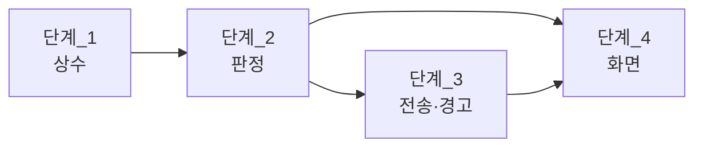

# 계획

**TL;DR**: 네 단계로 넣는다. 상수 · 판정 함수 · 전송 · 화면 순이고 앞이 뒤의 전제다. 4.3 이하 경로는 하나도 지우지 않고 분기만 얹는다. 각 단계에 4.3 회귀 확인을 붙였다.

## 단계_1 — 상수 (`PacketInfo.java`)

```java
static public final int RC_PROTOCOL_MINOR_COIN_COUNT = 4;   // 4.4 — 인덱스 7 이 개수가 된다

static public final int COIN_COUNT_DISABLE  = 0;    // 비활성
static public final int COIN_COUNT_MIN      = 1;
static public final int COIN_COUNT_MAX      = 100;
static public final int COIN_COUNT_INFINITE = 255;  // 무한 (휘발)

static public final int COIN_STEP_UP_WARN_LEVEL = 20;  // 25mV × 20 = 0.5V
```

**검증_1**: 빌드 통과. 기존 `COIN_MODE_*` 는 그대로 둔다(4.3 경로가 쓴다).

## 단계_2 — 판정 함수 (`MainActivity.java`)

| 함수 | 답 |
|---|---|
| `isCoinCountSupported()` | `isProtocolAtLeast(4, 4)` |
| `isCoinInfinite()` | 인덱스 7 == 255 **또는** (인덱스 8 == 1 이고 세대가 안다) |
| `isCoinCountEffective()` | `!isLinkFrozen() && !isBacktelCtrlMode()` |

`isLinkSettingUsable(RC_LINK_IDX_ONE_COIN)` 수정:

```java
if (isCoinCountSupported())
{
    return !isLinkFrozen();          // 백텔 모드에서도 무한은 유효하다
}
return !isLinkFrozen() && !isBacktelCtrlMode();
```

**검증_2**: 4.3 기기(또는 버전 미상)에서 `isCoinCountSupported()` 가 `false` 라 기존 식으로 떨어지는지.

> [!IMPORTANT]
> **의존**: 단계_1 이 있어야 한다.

## 단계_3 — 전송과 경고 (`MainActivity.java`)

`sendCoinCount(int value)` 신설 — 인덱스 7 한 번 쓰고 `requestLinkParamRefresh("코인 설정")`.

`makeLinkWarningText()` 두 곳:
- 무한 경고를 `isCoinInfinite()` 기준으로 (보완_1·보완_2)
- 상승 스텝 동반 효과 추가 — `isCoinCountSupported()` **이고** 코인 활성 **이고** 스텝 ≥ 20 일 때

**검증_3**: 4.3 에서 무한 경고가 지금과 같이 뜨는지. 4.3 에서 스텝 경고가 **안 뜨는지**.

## 단계_4 — 화면 (`RemoteControlFragment.java`)

1. Coin 버튼 → `isCoinCountSupported()` 면 `makeDialog_coinCountSelect()`, 아니면 기존 3택
2. 새 다이얼로그 — 무한 · 비활성 · 1~100 (102줄). 개수마다 견디는 시간. 무한은 «저장되지 않음» 안내. 백텔 모드면 «개수는 이 모드에서 쓰이지 않습니다» 안내
3. `updateCoinText()` — 무한 `∞` / 개수가 안 쓰이면 `N/A` / 비활성 `Off` / 개수 그 수. 4.3 이하는 지금 그대로 `On`·`Off`
4. `markAlert` 무한 판정을 `isCoinInfinite()` 로 (보완_1)

**검증_4**: 4.3 화면이 지금과 같은지. 4.4 에서 개수가 보이는지.

> [!IMPORTANT]
> **의존**: 단계_2·단계_3 이 있어야 한다.

## 테스트 순서



## 회귀 확인 (4.3 이하가 안 깨져야 한다)

| 항목 | 기대 |
|---|---|
| Coin 다이얼로그 | 비활성 / 사용 / 무한 3택 그대로 |
| 두 패킷 전송 | `sendCoinMode` 경로 그대로 |
| 백텔 모드 잠금 | 코인 버튼 통째로 잠김 (기존과 같음) |
| `Coin` 칸 | `On` · `Off` · `∞` · `N/A` · `-` 그대로 |
| 상승 스텝 경고 | **뜨지 않는다** |

## 범위 밖

| 항목 | 이유 |
|---|---|
| 인덱스 8 을 쓰는 경로 제거 | 4.3 이하가 쓴다. 4.4 에서 «안 쓸» 뿐 지우지 않는다 |
| `101~254` 거부 응답 처리 | 앱이 그 값을 만들지 않는다 |
| 펌웨어 문서의 의사코드 수정 | 다른 저장소다. 은수님께 보고한다 |
