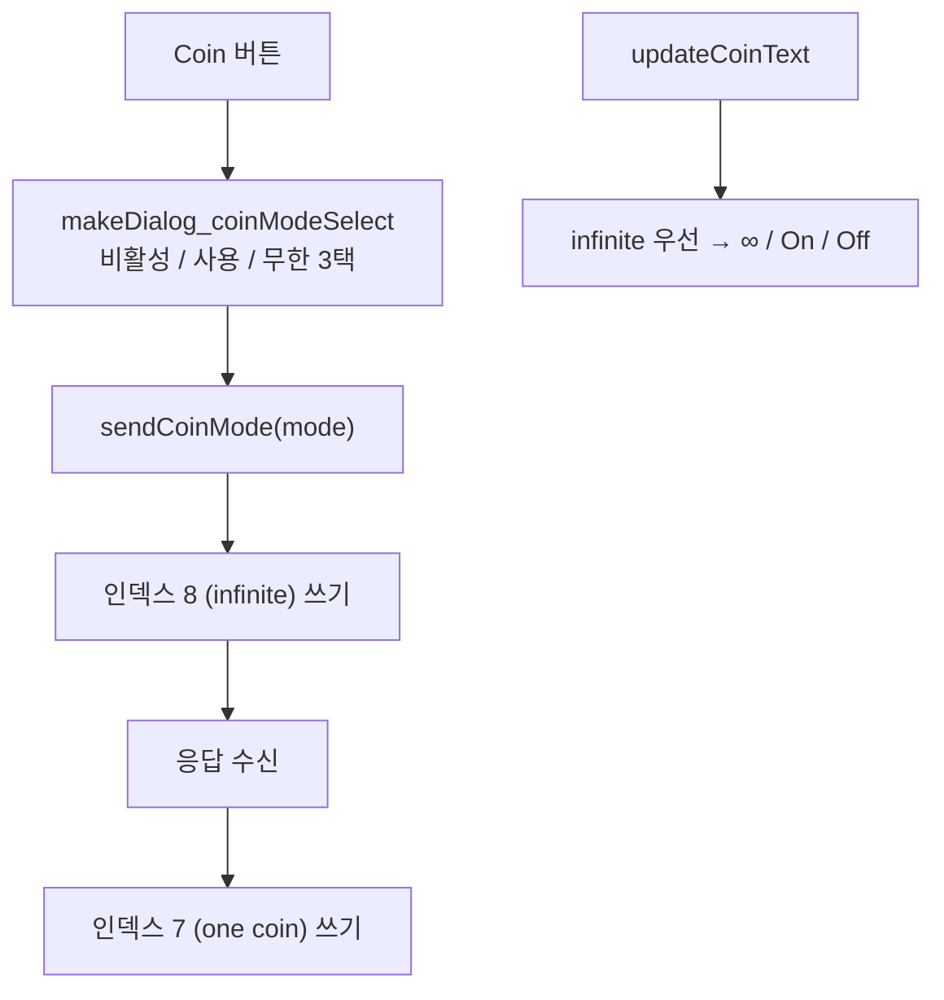

# 분석

**TL;DR**: 4.4 지원은 인덱스 7 의 «뜻» 이 바뀐 것이라 통신 코드는 그대로고 해석과 화면만 바뀐다. 쓰기는 두 패킷에서 한 패킷으로 줄어 오히려 단순해진다. 갈림은 `minor >= 4` 한 곳이고, 백텔 모드 잠금 규칙이 함께 바뀐다.

## 1. 지금 앱이 코인을 다루는 방식



**두 패킷으로 나뉜 이유**는 `sendPacket()` 이 응답 전 다음 패킷을 버리기 때문이다(`MainActivity.java:2259` 주석). 4.4 에서는 **한 패킷이면 끝나므로 이 대기 기계가 통째로 필요 없어진다.**

## 2. 무엇이 바뀌는가

| 층 | 바뀌나 | 내용 |
|---|---|---|
| 패킷 생성·전송 | **아니오** | `59 20 01 07 <값>` 그대로. 값의 범위만 넓어진다 |
| 응답 파싱 | **아니오** | `& 0xFF` 라 `255` 가 그대로 들어온다(`MainActivity.java:2391`). `LINK_VALUE_UNKNOWN = -1` 과 겹치지 않는다 |
| 세대·버전 판별 | **아니오** | `fwReleaseName()` 이 major.minor 를 그대로 찍어 «REL4.4» 가 된다 |
| **값의 해석** | **예** | `1` 이 «사용» 이 아니라 «1개» 다. `255` 가 무한이다 |
| **쓰기 절차** | **예** | 두 패킷 → 한 패킷 |
| **의존성 잠금** | **예** | 백텔 모드에서 개수만 잠근다 |
| **경고** | **예** | 상승 스텝 동반 효과 추가. 무한 판정을 두 인덱스로 |
| **화면** | **예** | 개수 표시 · 개수 선택 다이얼로그 · 견디는 시간 |

## 3. 판단

### 판단_1 — 갈림은 `minor >= 4` 하나로 모은다

`isCoinCountSupported()` 하나를 두고 모든 분기가 이를 부른다. 인덱스 7 자체는 REL4 전 구간에 있으므로 **`isLinkParamSupported(7)` 은 건드리지 않는다.** 있느냐가 아니라 **어떤 뜻이냐**의 문제다.

> [!NOTE]
> `isProtocolAtLeast()` 는 버전을 못 읽은 세대(REL4·REL3)에서 `false` 를 낸다(`MainActivity.java:1279`). 그래서 옛 기기는 자동으로 4.3 이하 경로를 탄다. 따로 막을 필요가 없다.

### 판단_2 — 백텔 모드에서 버튼은 열고 개수만 무시로 표시

요구사항-검증의 문서 불일치를 **«개수만 잠근다»** 로 판정했다. 그러면 `isLinkSettingUsable(7)` 하나로는 부족하다. 두 가지를 갈라야 한다.

| 질문 | 함수 | 쓰이는 곳 |
|---|---|---|
| 코인을 **설정할 수 있는가** | `isLinkSettingUsable(7)` | 버튼 잠금 |
| **개수가 실제로 쓰이는가** | `isCoinCountEffective()` | `N/A` 표시 · 다이얼로그 안내 |

4.3 이하에서는 둘이 같은 답을 낸다(코인이 스위치뿐이라 개수 개념이 없다). **4.4 에서만 갈린다.**

### 판단_3 — 무한 판정은 인덱스 7 을 먼저 본다

```
무한인가 = (인덱스 7 == 255) 또는 (인덱스 8 == 1 이고 그 인덱스를 이 세대가 안다)
```

인덱스 7 을 앞에 두는 이유는 **쓰기 직후**다. `255` 를 쓰면 인덱스 7 응답은 바로 반영되지만 인덱스 8 은 다음 전체 읽기까지 낡은 값(`0`)으로 남는다. 인덱스 8 만 보면 방금 켠 무한이 화면에 안 뜬다.

### 판단_4 — 쓰기 뒤 전체 읽기를 한 번 예약한다

인덱스 7 에 `255` 를 쓰면 **인덱스 8 도 따라 바뀐다.** 화면 표시는 판단_3 으로 이미 맞지만, 다음 감시 주기(16초)까지 인덱스 8 이 낡은 채로 남아 있으면 다른 판단에 섞인다. 기존 `requestLinkParamRefresh()` 를 그대로 쓴다.

### 판단_5 — 견디는 시간 계산

```
견디는 시간(초) = 개수 × 백텔주기 × 0.1
```

백텔 주기(인덱스 2)는 100msec 단위다. 주기를 아직 못 읽었으면 시간을 붙이지 않는다. **모르는 값으로 계산해 그럴듯한 숫자를 보여 주는 것이 가장 나쁘다.**

### 판단_6 — 목록 102개는 그대로 낸다

무한 · 비활성 · 1~100 이면 102줄이다. 길지만 규격서가 지정한 순서이고, 단일 선택 목록은 스크롤되며 현재 값에 체크가 붙어 그 자리로 열린다. **구간을 줄이면 규격과 어긋나고 시험 자유도가 깎인다.**

### 판단_7 — 상승 스텝 경고 기준

문서가 «스텝 40 이면 1.0V» 를 예로 든다. 매번 띄우면 소음이라 **0.5V(스텝 20) 이상일 때만** 띄우고, 실제 전압을 계산해 보여 준다. 코인이 꺼져 있으면 띄우지 않는다.

## 4. 바뀌는 자리

| 파일 | 무엇 |
|---|---|
| `params/PacketInfo.java` | `RC_PROTOCOL_MINOR_COIN_COUNT` · 코인 값 상수 4개 · 경고 기준 |
| `activity/MainActivity.java` | `isCoinCountSupported` · `isCoinInfinite` · `isCoinCountEffective` · `sendCoinCount` 신설, `isLinkSettingUsable(7)` · `makeLinkWarningText` 수정 |
| `fragment/RemoteControlFragment.java` | 개수 선택 다이얼로그 신설, `updateCoinText` · `markAlert` 수정 |

`sendCoinMode()` 와 `sendPendingOneCoinPacket()` 은 **지운다가 아니라 남긴다.** 4.3 이하 기기가 여전히 그 경로를 쓴다.

## 5. 남은 불확실성

| 항목 | 상태 |
|---|---|
| 4.4 펌웨어 실기 | 붙여 본 적 없다 |
| `101~254` 거부 응답 | 앱이 그 값을 만들지 않으므로 실제로 겪을 일이 없다. 에러 처리는 기존 경로 |
| 무한 해제 뒤 파일에 남은 개수 | 전원 재투입 시 그 개수로 돌아온다. **앱은 다시 읽으면 되므로 따로 기억하지 않는다** |
