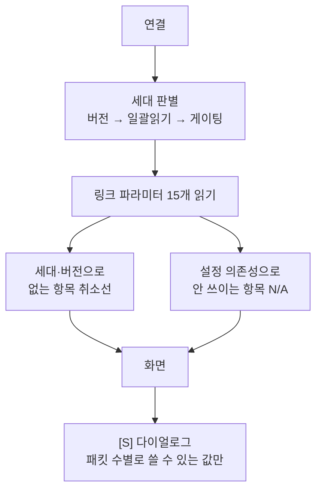

# 리모콘 앱 인수인계

**TL;DR**: 사운드처리기 `0x59` 를 도메인 구조로 갈아엎고, 앱이 펌웨어 세대를 **물어봐서** 알아내도록 바꿨다. 목적은 **백텔 읽기 직전 전원 안정 Nop(`[S]`) 을 리모콘에서 시험**하는 것이다. OTA 는 수집 폴더와 전송 슬롯을 갈랐다. 커밋 `50f0732` 까지 올렸고 **그 뒤 소스 8개가 미커밋**이다. 실기에서 결함 2건(§4 마지막 두 줄)을 잡았으나 **나머지는 아직 확인 전이다.**

관련: [`0x59 프로토콜 규격`](../../sullivan-1-5-fw-hw-test-link-pwr-bt-period/docs/참고/리모콘%20프로토콜/0x59%20프로토콜%20규격.md) · [`설정 의존성과 앱 UI 규칙`](../../sullivan-1-5-fw-hw-test-link-pwr-bt-period/docs/참고/리모콘%20프로토콜/설정%20의존성과%20앱%20UI%20규칙.md) · [`안드로이드 앱 구현 사례`](../../sullivan-1-5-fw-hw-test-link-pwr-bt-period/docs/참고/리모콘%20프로토콜/안드로이드%20앱%20구현%20사례.md)

> [!IMPORTANT]
> **브랜치는 `develop_ota` 다.** 푸시하지 않았다.
> 빌드는 `JAVA_HOME` 을 Android Studio 의 JBR 로 잡고 `source/` 에서 `./gradlew assembleDebug` 다.

## 1. 이 작업이 왜 시작됐나

사운드처리기가 백텔을 읽기 **직전**에 `NopStandby`(`[S]`) 를 몇 개 넣을지가 링크 성능에 영향을 준다.
2026-08-06 에 2개를 넣었는데 **그 효과가 계측된 바 없어**, 개수를 바꿔 가며 확인하려는 것이 이번 작업의 목적이다.

그러려면 리모콘에서 그 값을 읽고 쓸 수 있어야 하는데, 그 과정에서 `0x59` 프로토콜 자체가
도메인 구조로 개편되었고 앱도 따라 전면 개편이 필요해졌다.

## 2. 큰 그림



## 3. 무엇이 바뀌었나

### 3.1 0x59 프로토콜 — 도메인 구조

파라미터마다 옵션 번호를 하나씩 쓰던 방식을 버렸다. 도메인(링크 `0x20` · 자극 `0x21` ·
배터리 `0x22`) 하나에 옵션 하나를 두고 값은 **데이터 인덱스**로 고른다.

| 요청 | `[0] 0x59` `[1] 옵션` `[2] 액세스` `[3] 인덱스` `[4] 값` |
|---|---|
| 응답 | `[0] 0x59` `[1] 옵션` `[2] 액세스` `[3] 인덱스` `[4] 값의 «바이트 수»` `[5..] 값` |

옵션 `255` 로 버전과 지원 옵션 비트맵을 읽는다. 지금 최신은 **4.3** 이다.

### 3.2 펌웨어 세대 자동 판별

필드에 세대가 섞여 있고, 그 세대가 모르는 옵션을 보내면 **에러가 아니라 연결이 끊긴다.**
그래서 사람이 고르게 하지 않고 되는 것을 찾을 때까지 위에서부터 물어본다.

| 세대 | 판정 | 배지 |
|---|---|---|
| REL4+ | 버전 조회(`59 FF 00`) 응답 | **읽어 온 버전 그대로** (`REL4.3`) |
| REL4 | 버전은 거절, 일괄 읽기(`59 11`) 응답 | `REL4` |
| REL3 | 둘 다 거절, 게이팅(`59 01`)만 응답 | `REL3` |

- **판별과 상태 읽기가 같은 패킷으로 이뤄진다.** 세대를 알아내려고 따로 왕복하지 않는다
- REL4 는 **일괄 읽기 응답의 값 개수**가 곧 그 기기가 아는 인덱스 상한이다.
  같은 REL4 라도 시기마다 7 · 8 · 10개로 다르므로 상수로 박으면 틀린다
- 구 프로토콜에는 인덱스를 구 옵션 번호로 **번역해서** 보낸다. 그래서 버튼도 그대로 동작한다

### 3.3 전원 안정 Nop — 이번 작업의 본체

`0x20` 인덱스 **11**. 아무 값이나 넣으면 자리 맞추기가 낭비되므로, **지금 패킷 수(인덱스 13)에서
자리 맞추기가 0 이 되는 값만** 목록에 올리고 각 값이 자극을 얼마나 끊는지 함께 보여 준다.

> [!WARNING]
> **표는 패킷 수(13)로 찾는다. 펄스폭(12)으로 찾으면 nOFm 에서 틀린다.**
> nOFm 은 밴드 16 이상이면 패킷 수를 3 으로 고정해 펄스폭과 어긋난다.

두 상한이 다르다.

| 구분 | 넘기면 | 앱 표시 |
|---|---|---|
| 실상한 | 조용히 잘린다 | `[N 로 잘림]` |
| 자극이 남는 최대 | 그 사이클 자극이 **0** | `[자극 0]` |

**막지 않는다.** 자극이 어차피 0 인 구간도 전원 회복 시간을 늘리려고 쓸 이유가 있다.

- 패킷 수 **9** 는 어떤 값을 넣어도 자극이 남지 않는다 — 「줄여도 살아나지 않습니다」로 안내
- 패킷 수 **5 · 7** 은 기본값이 곧 한계다 — 「한 칸만 올려도 자극이 없어집니다」
- 값의 출처는 인덱스 14 로 구분해 **별표**로 표시한다 (`Nop 3*` = 리모콘이 정한 값)

### 3.4 설정 의존성 — 취소선과 N/A

판정을 **두 함수로만** 가른다. 버튼 잠금과 상태 표시가 같은 함수를 쓰므로 어긋날 수 없다.

| 물음 | 함수 | 아니면 |
|---|---|---|
| 이 세대·버전이 아는가 | `isLinkParamSupported(index)` | ~~취소선~~ |
| 지금 설정에서 쓰이는가 | `isLinkSettingUsable(index)` | `N/A` |

| 상태 | Coin | Accel | BT | PMIC | Step | Mode | Nop |
|---|---|---|---|---|---|---|---|
| ISD 모드 | `On` | **`N/A`** | `300ms` | `4.0V` | `4` | `ISD` | `3` |
| BT 모드 | **`N/A`** | `On` | `300ms` | `4.0V` | `4` | `BT` | `3` |
| BT + infinite | **`∞`** | `On` | `300ms` | `4.0V` | `4` | `BT` | `3` |
| 백텔 미출력(패킷 수 ≥ 10) | `N/A` | `N/A` | `N/A` | `N/A` | `N/A` | `N/A` | `N/A` |

> [!CAUTION]
> **코인 칸만 순서가 있다.** 백텔 수신 기준 모드에서 one coin 은 무시되지만 **infinite 는 유효하다.**
> 무한을 먼저 걸러 내지 않으면 「링크 에러가 안 뜨는 상태」를 화면이 감춘다.

### 3.5 OTA — 수집 폴더와 전송 슬롯을 갈랐다

예전에는 `List of slots` 가 **읽을 폴더까지** 정했다. 슬롯 2 에 넣으려면 파일을 슬롯 2 폴더로
옮겨야 했다.

```
Collect  →  /sdcard/OTA/ 아래 폴더를 다이얼로그로 골라 그 안의 MFST~APP2 를 읽는다
Write    →  읽어 둔 것을 List of slots 번호로 전송 (0x60 매핑 연결 후)
Select   →  List of slots 번호로 부팅 슬롯 선택
```

- 수집 결과는 슬롯과 무관한 **한 벌**에 담는다 (`Ota.SLOT_NUM_COLLECT`). 쓸 때 목표 슬롯만 갈아 끼운다
- `List of files` 라디오는 **없앴다.** Collect · Write 가 각각 MFST 부터 APP2 까지 순서대로 처리한다
- **Write 는 매핑 연결(`0x60`) 응답을 받은 뒤 시작한다.** 사운드처리기는 매핑 프로그램이 붙은 상태에서만 이미지를 받는다
- `Status of files` 옆에 `Folder: OTA/<폴더>` 로 어디서 읽었는지 보여 준다
- **앱이 슬롯 번호 폴더(`OTA/1` · `OTA/2`)를 만들지 않는다.** 어느 폴더에서 읽을지는
  고르는 것이라, 쓰지도 않을 폴더를 미리 만들면 목록만 지저분해진다.
  `OTA/` 최상위만 Collect 가 필요할 때 만든다

> [!NOTE]
> **매핑 연결 해제(`0x61`)는 보내지 않는다.** 펌웨어가 SPI 송신이 비는 즉시
> **워치독 리셋으로 재부팅**시킨다. 전송 직후에 보내면 의도치 않게 재부팅된다.

### 3.6 화면

- **상태 격자 19칸 4열 5행.** 색으로 분류하고, 읽는 순서대로 같은 색이 이어진다
  - 진한 주황(현재 Tx 파워) · 노랑(PMIC 설정값) · 하늘(타이밍) · 보라(제어) · 분홍(맵·자극) · 초록(기기)
  - **형광 연두 두 칸(`Nop` · `Mode`)이 지금 시험 중인 항목이다.** 나란히 두고 격자에서 이 색은 여기만 쓴다
- **REL 배지**를 내부기 제조번호 우상단에 띄운다. 색은 세대별(주황 · 노랑 · 초록)
- **화면 방향 고정** — 폰이면 세로, 태블릿이면 가로. 가장 작은 변 600dp 기준(`values-sw600dp` 와 같은 값)
- **시작 화면에서 사용설명서와 잠금화면을 뺐다.** 기능은 남아 있고 설정 화면에서 쓴다.
  잠금 암호가 없으면 `000000` 을 자동으로 넣는다

## 4. 고친 결함 — 다시 밟지 않게

| 결함 | 증상 | 원인 |
|---|---|---|
| **에러 응답 길이** | 연결 → 해제 **무한 반복** | `sendErrorToApp()` 은 6바이트인데 앱이 3바이트로 알아 사이즈 에러로 끊었다. 세대 판별은 일부러 모르는 옵션을 보내므로 매번 걸렸다 |
| **`onLinkInfoReadFailed` 미호출** | 판별이 버전 단계에서 멈춤 | 선언만 하고 아무 데서도 부르지 않았다 |
| **판별 중 포맷 판단** | 버전 응답을 구형으로 해석 | 세대로 포맷을 가르면 버전 응답 시점에는 아직 세대가 미상이다. **옵션 번호로 가른다**(구 3~23 vs 도메인 0x20~) |
| **프로그램 변경 후 PW 미갱신** | 이전 프로그램 기준으로 `[S]` 목록 생성 | 프로그램 응답(0x44)이 링크 파라미터를 다시 읽지 않았다 |
| **다이얼로그 목록이 안 보임** | 「이미 표시 중」만 나옴 | `setMessage` 와 선택 목록이 같은 자리를 써서 메시지가 목록을 밀어냈다. 안내는 제목 자리에 그린다 |
| **다이얼로그 참조 누수** | 한 번 뜬 뒤 **모든** 다이얼로그가 막힘 | 안내 다이얼로그 10곳이 닫혀도 `mDialog` 를 비우지 않았다. 화면을 나갔다 와야 풀렸다 |
| **REL4 one coin** | 값을 읽고도 `Coin -`, 설정도 안 나감 | infinite 가 없는 초기 REL4 에서 infinite 를 먼저 보내다 거절당해 one coin 이 영영 안 나갔다 |
| **초기화가 설정을 되살림** | 매뉴얼·잠금이 계속 다시 뜸 | 전체 초기화가 `setEnable(true)` 로 **저장**해서 기본값을 이겼다 |
| **Write 가 전송을 시작 안 함** | 매핑 연결까지 가고 그 뒤 없음 | 전송 시작이 **배경 스레드**에서 돌아, 거기서 세운 대기 표시를 메인 스레드가 못 읽었다(메모리 가시성). 파일 읽기가 Collect 로 옮겨진 뒤로 스레드가 필요 없어져 메인 스레드로 옮겼다 |
| **OTA 상태가 굳음** | 주기적 읽기와 Write 가 **영영** 멈춤 | `Ota` 가 싱글턴인데 `commState` 를 연결 해제 시 되돌리지 않았다. 전송이 응답을 기다리다 끊기면 «전송 중» 으로 굳어, 재연결해도 감시 러너와 Write 가 매번 물러났다. 프로세스를 새로 띄워야만 풀렸다 |

## 5. 지금 상태

| 항목 | 상태 |
|---|---|
| 브랜치 | `develop_ota` — **푸시 안 함** |
| 마지막 커밋 | `50f0732` 0x59 프로토콜을 도메인 구조로 개편하고 펌웨어 세대를 자동 판별함 |
| 미커밋 | **소스 8개 파일** (+894 / −247) + `docs/` — OTA 폴더 분리 · 설정 의존성 · N/A · 방향 고정 · 시작 화면 · OTA 결함 2건 수정 |
| 빌드 | `assembleDebug` 통과 |
| **실기 검증** | 연결 · 세대 판별 · 매핑 연결까지만 확인. **OTA 전송과 `[S]` 시험은 미확인** |

> [!CAUTION]
> **실기에서 확인된 것은 «연결 · 세대 판별 · 매핑 연결» 까지다.**
> OTA 전송은 결함 2건을 잡은 뒤 **아직 다시 시험하지 못했다.**
> 나머지(`[S]` 목록 · 의존성 잠금 · 방향 고정)는 코드 검증과 문서 대조만 거쳤다.
> 아래 6장을 순서대로 밟아 확인해야 한다.

## 6. 넘겨받으면 먼저 할 일

1. **미커밋 소스 8개와 `docs/` 를 검토하고 커밋한다.** 커밋 형식은 `50f0732` 를 따른다
   (한국어 제목 `~함` + 이유를 담은 불릿, **AI 표시 금지**)
2. **세대별 연결 확인** — REL3 · REL4 · REL4+ 펌웨어에 각각 붙여 배지와 취소선을 본다
3. **`[S]` 시험** — Nop Standby 버튼 → 패킷 수에 맞는 값만 뜨는지, 고른 값이 반영되는지
4. **프로그램 전환** — 프로그램을 바꾼 직후 `PW` · `Frm` · `Strat` 이 따라오는지
5. **OTA** — 폴더 선택 → Collect → Write 로 네 파일이 순서대로 올라가는지
6. **화면 방향** — 폰에서 세로, 태블릿에서 가로. 폴더블이 있으면 펴서 안내가 뜨는지

## 7. 실기에서 문제가 났을 때 — 로그 꺼내는 법

**logcat 은 버퍼가 금방 밀린다.** OTA 는 몇 분씩 걸리는 동작이라 나중에 보면 이미 없다.
대신 앱이 **DB 에 남기는 로그**가 재부팅을 넘어 남는다. 디버그 빌드라 `run-as` 로 꺼낼 수 있다.

```sh
PKG=kr.co.todoc.cochlear.implant.ota

# 세 파일을 함께 꺼낸다. WAL 에 최근 기록이 들어 있어 본체만 받으면 대부분 빠진다.
for f in remote_log remote_log-shm remote_log-wal; do
    adb exec-out "run-as $PKG cat databases/$f" > "$f"
done
```

> [!WARNING]
> **`adb shell cat` 이 아니라 `adb exec-out` 이다.** `shell` 은 개행을 변환해 바이너리를
> 망가뜨린다. 실제로 그렇게 받았다가 `database disk image is malformed` 로 절반만 읽혔다.

```python
import sqlite3
c = sqlite3.connect('remote_log')
for n, d, m in c.execute('select number, date, message from EntityLog order by number'):
    print(d, m)
```

기록되는 것 — 연결·해제, 세대 판별 결과, 0x59 수신, **OTA 전송 시작·파일 완료·실패 지점**
(어느 파일 몇 번째 인덱스에서 멈췄는지), OTA 상태 초기화.

설치된 APK 가 최신인지도 함께 본다. 옛 빌드를 시험하고 있던 적이 있다.

```sh
adb shell "stat -c '%y %n' \$(pm path $PKG | sed 's/package://')"
```

## 8. 파일 지도

| 무엇 | 어디 |
|---|---|
| 프로토콜 상수 · `[S]` 표 · 구 옵션 대응표 | `params/PacketInfo.java` |
| 세대 판별 · 의존성 판정 · 송수신 | `activity/MainActivity.java` |
| 화면 · 다이얼로그 · OTA 수집/전송 | `fragment/RemoteControlFragment.java` |
| 상태 격자 · 배지 · OTA 화면 | `res/layout/fragment_remote_control.xml` |
| 세대 · 관찰된 인덱스 상한 | `params/Status.java` |
| OTA 파일 버퍼 · 수집 폴더 | `ota/Ota.java` |
| 방향 고정 | `AndroidManifest.xml` (configChanges) + `MainActivity.applyScreenOrientation()` |

## 9. 알려진 제약

| 제약 | 내용 |
|---|---|
| **전체 읽기 20바이트** | 헤더 5 + 값 15 = 20 으로 **BLE 한 패킷 상한에 닿아 있다.** 링크 인덱스를 하나만 더 늘리면 넘친다. 포맷을 함께 손봐야 하는 별도 작업이다 |
| **매핑 모드 판정 불가** | `0x20` 으로는 「지금 매핑 중인가」를 알 수 없다. 정본 §6 의 매핑 관련 규칙은 구현하지 않았다 |
| **멀티윈도우** | 방향 판정이 기기가 아니라 **창 크기**를 본다. 태블릿에서 분할 화면을 쓰면 폰으로 잡힐 수 있다. 필요하면 `androidx.window` 의 `computeMaximumWindowMetrics()` 로 바꾼다 |
| **되읽은 `[S]` ≠ 실제 개수** | 펌웨어가 매 백텔 사이클마다 FIFO 여유로 다시 자른다. 화면 값은 «설정값» 이다 |
| **맵 계산 대기 500ms** | 프로그램 변경 후 재조회까지의 대기다. 실측값이 아니라 **가정**이다. 한 박자 늦으면 이 값을 올린다 |
| **싱글턴에 남는 상태** | `Ota` · `Status` 는 싱글턴이라 연결·재연결은 물론 액티비티 재생성을 넘어 값이 남는다. 연결 해제 자리에서 되돌려야 할 값을 빠뜨리면 «앱을 껐다 켜야만 풀리는» 증상이 된다. `commState` 가 그랬다 |
